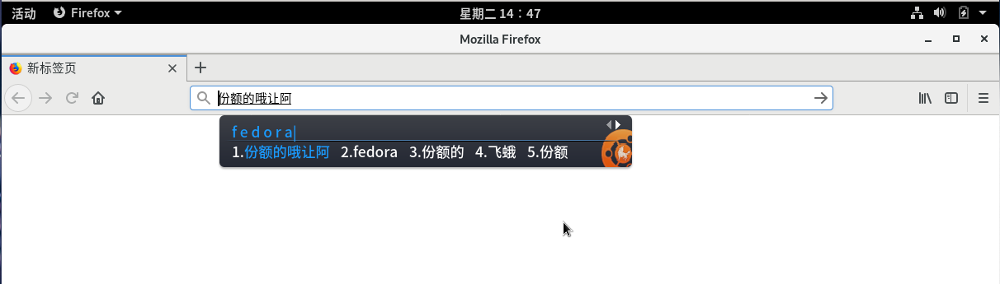

# Fedora-搜狗输入法安装脚本

该脚本测试于 Fedora-GNOME-29上。其他版本自测，理论通用

## 如何使用

fedora-GNOME-29中，ibus与桌面环境高度集成，卸载ibus可能导致意想不到的后果(比如gnome桌面崩溃)。所以没必要卸载ibus输入法。

下载仓库

```
git clone https://gitee.com/xuthus5/fedora-sogou-pinyin.git
```

脚本加权限

```
cd fedora-sogou-pinyin

chmod +x *.sh
```

如果你尚未安装fcitx(亦或你无法调用起fcitx),你可以使用如下命令,完成fcitx的配置安装

```
./install.sh config
```

如果你已经完成了fcitx的安装,并且可以使用它,请使用如下命令完成搜狗输入法的安装

```
./install.sh install
```

说明：参数须一一对应 否则可能出错。

## 结果演示

fcitx默认Ctrl+Space 快捷键切换输入法




若需要卸载，执行 uninstall.sh 脚本。可以干净清除

```
sudo ./uninstall.sh
```
